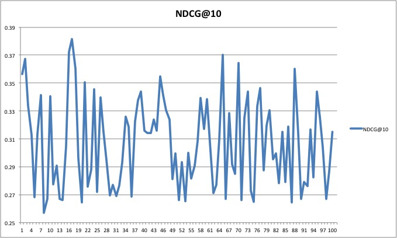
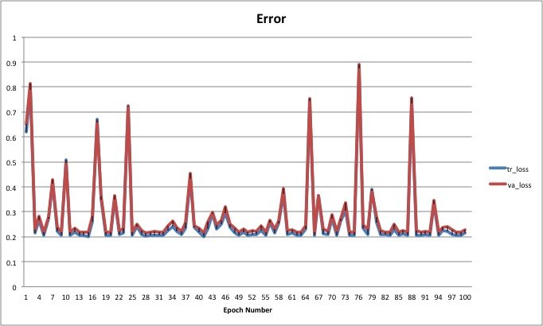
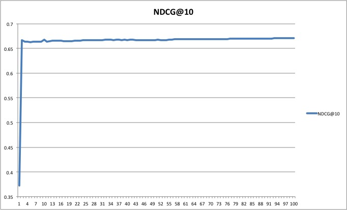
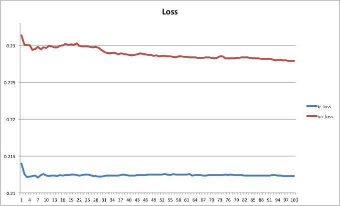
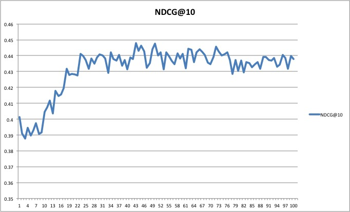
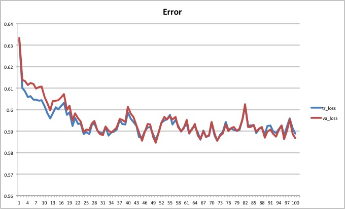
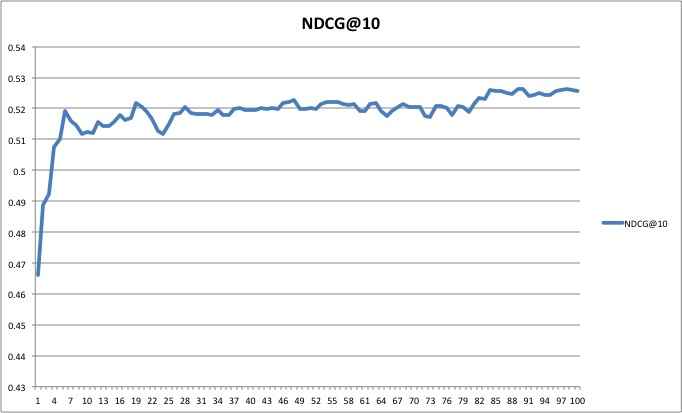
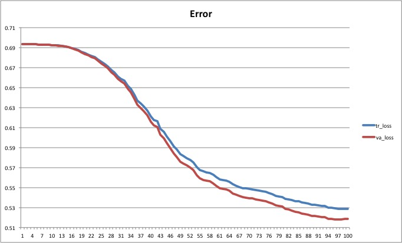

# Overview of Algorithms

## Introduction

LTR4L is a Learning to Rank project for Lucene.
The purpose of this document is to provide a general overview of implemented algorithms.
More specifically, it is meant to provide a "big picture," interpretation, or explanation of each network, as well as some experimental results for comparison purposes.
For specific mathematical details and formulation, please see implementation or original articles.

The three different types of machine learning are supervised learning (training labels provided for all labels),
semi-supervised learning (training labels only provided for the training set), and unsupervised learning (no labels provided).
This project currently only implements supervised learning.

In learning-to-rank, there are three different approaches: pointwise (training involves looking at documents of a query independently),
pairwise (training involves looking at pairs of documents; i.e. which document is more relevant), and listwise (training involves looking
at a list of documents for a given query). The following algorithms have been implemented thus far:

1) PRank (Perceptron Ranking)                             [pointwise]
2) OAP-BPM (Online Aggregate Prank-Bayes Point Machine)   [pointwise]
3) NNRank (Neural Network Ranking)                        [pointwise]
4) RankNet (Ranking Network)                              [pairwise]
5) FRankNet                                               [pairwise/listwise]
6) LambdaRank                                             [pairwise/listwise]
7) SortNet (Sorting Network)                              [pairwise]
8) ListNet                                                [listwise]


## Overview

Document features
Neural Network

## Algorithm Guide

#### PRank
Type: Single Perceptron  
Approach: Pointwise  
Strengths:  Very simple structure, very fast  
Weaknesses: Only linear results/weights can be obtained (not very effective for non-linear data sets).  
Network Input: A single document's features  
Network Output: Relevance score**  
Weights updated by document.  

PRank is essentially the inner product between a weight vector and a document's features. Both vectors are the space of real numbers.
The inner product is the predicted relevance score, and based off of this score, PRank classifies the document.
The document can be classified into categories such as: highly-relevant, relevant, irrelevant or 3-star, 2-star, 1-star, etc...
The simplest classification would be between two classes: relevant and irrelevant.

To determine whether a score falls into a category, PRank looks at "threshold values." Threshold values are similar to a grading system.
For example, if score >= 90, A
if 80 <= score < 90, B
etc...

When PRank is learning, it essentially changes both the weight vector and threshold values, if the predicted score is not correct.
In terms of the grading analogy, it is as if the teacher how many points each problem is worth (weights),
as well as the number of points needed to get a certain score.
The farther away the predicted category is from the actual category, the more the weights and thresholds are changed.
Weights and thresholds are updated per document, and documents are chosen at random.

Note that in terms of a Neural Network, the structure behind PRank is relatively simple. It can be thought of as
a network with only two layers: the input layer, and the output layer. In the input layer, each node
represents a feature of the document (thus the number of nodes is equal to the number of features of the document). In the output layer, there is one node.
The activation for each node in the network is the identity function, and each node's output is multiplied by a weight,
and that becomes one of the inputs of the output node.

#### OAP-BPM
Type: PRank Network  
Approach: Pointwise  
Strengths: Relatively simple structure, more effective learning than PRank (rise in NDCG, decrease in loss)  
Weaknesses: Slower than PRank, only linear results/weights can be obtained  
Network Input: A single document's features  
Network Output: Relevance score**  
Weights updated by document.  

OAP-BPM is an algorithm which uses N PRanks, and a Bernoulli number τ.  
τ is a number between 0 and 1: 0 < τ <= 1. Bernoulli(τ) returns 1 with a probability of τ, 0 otherwise.  
The average weight of all of the PRanks is equal to the weight of the OAPBPM.  
Each iteration, OAP-BPM will present a document to a particular PRank instance with a probability of τ.  
If a document is presented to a PRank, the PRank will predict the class and update its weights accordingly.  
Then, OAP-BPM's weights are updated by PRank's weight / N.  

Please see below for an example of presentation of documents and update of weights below:  

```
for i = 0 until i = N
  pRank = pranks[i]
  if (bernoulli(τ) == 1)
    predictAndUpdate(prank)
  if(prank.weightsChanged)
    this.Weights += prank.Weights / N

end for
```

#### NNRank
Type: Feed-forward neural network (Multi-layer perceptron)  
Approach: Pointwise  
Strengths: Relatively fast and accurate, online and batch mode, can handle non-linear data  
Weaknesses:  
Network Input: A single document's features.  
Network Output: Document's classification (for a particular query)  
Weights updated per document.  

NNRank uses a Multi-layer perceptron network, where the output layer has a number of nodes equal to
the number of ordinal categories (for example, if the categories are 1, 2, 3, and 4 stars, there will be 4 output nodes).
The key difference of NNRank (from other implemented MLP algorithms) is that the network directly tries to classify a given document,
rather than output a relevance score.
Strictly speaking, this method falls into the multi-threshold approach.


#### RankNet
Type: Feed-forward neural network  
Approach: Pairwise*  
Strengths: Relatively high accuracy. Has been widely adopted to much success.  
Weaknesses: Very slow for training through all document paris.  
Network Input: A single document's features  
Network Output: Relevance Score  
Weights updated per document pair  

RankNet uses a Multi-Layer perceptron network, where the output layer has one node.
It works to solve the preference learning problem directly, rather than solving an
ordinal regression (i.e. a classification problem). While only a single document is
necessary for forward-propagation (and thus ranking), a pairwise cross-entropy error
function is used to measure loss, and thus two documents are required for backpropagation
(as loss is defined over two documents, the derivative of the loss must be taken with respect
to document pairs). Therefore, RankNet is considered a pairwise approach, document pairs are
used as instances during training.

For the experiment, to give an accurate idea of how long RankNet takes, we looked at every document pair.
However, in the actual implementation, we only looked at 1/6 of the pairs. We have provided the results for both.

#### FRankNet

Type: Feed-forward neural network  
Approach: Pairwise, Listwise*  
Strengths: Faster than ranknet, updates less frequently.  
Weaknesses:  
Network Input: A single document's features  
Network Output: Relevance Score  
Weights updated per query  

FRankNet is a modification of RankNet. The structure of the network in FRankNet is unchanged from RankNet.
The difference lies in the way that the weights are updated. RankNet looks at how well the current model predicts
a pair of documents and adjusts the model. FRankNet looks at how well the current model predicts for many different pairs,
then adjusts the model.

In RankNet, first the output function is calculated for a pair of documents in a particular query,
then the derivative of the cost function is taken with respect to the difference of scores of the pair, and that is used to
update the weights. When updating for every pair of documents, two backpropagations are required for every pair.
Thus, for N documents in a query, the total number of updates per query is:  
N(N-1)/2,  
and the total number of times backpropagation occurs is:
N(N-1).

In FRankNet, the weights are updated per query.
The output function is first calculated for every pair in the query and combined (added and subtracted appropriately).
Then, the derivative of the cost function is taken with respect to the score of a document (not the difference of scores of a document pair) using the output.
This derivative is called λi (for document i) and it is used for backpropagation. After this is done for every document in the query, the weights are updated.
Thus, for N documents in a query, the total number of updates per query is:  
1,  
and the total number of times backpropagation occurs is:  
N.

The approach is pairwise because the cost function is defined for document pairs, and listwise because
all of the document pairs (and thus all of the documents) in a query are used; thus a document list for the query
is required.


#### LambdaRank
Type: Feed-forward neural network  
Approach: Pairwise, Listwise*  
Strengths: Faster than ranknet, updates less frequently.  
Weaknesses:  
Network Input: A single document's features  
Network Output: Relevance Score  
Weights updated per query  

LambdaRank is a modification of FRankNet. The structure of the network remains unchanged.

The main difference is when calculating the λi by looking at all pairs with document i (explained in FRankNet),
the value is multiplied by |ΔNDCG| of swapping the two documents. Please refer to the original article for the reasoning behind
the use of this term.
 
#### SortNet
Type: Comparative Neural Network  
Approach: Pairwise  
Strengths:   
Weaknesses:  
Network Input: Two document's features
Network Output: Preference between the two documents (which document is more relevant)  
Weights updated per document (/ pair)

The structure of SortNet's neural network is different from the rest of the networks implemented thus far in this project.
Apart from the fact that the features of two documents are required for forward propagation, the output layer must have two nodes,
and each hidden layer must have an even number of nodes. The reason for this is that there is symmetry in the network, such that
the weights between ni and n1 are equal to ni' and n1', and the weights between ni and n1' are equal to ni' and n1.

Note: As the output of the network is the preference between the two documents, there is no way to directly calculate the score of a document,
nor is there a way to classify the document (for ordinal regression).

#### ListNet
Type: Feed-forward neural network  
Approach: Listwise 
Strengths:  
Weaknesses:  
Network Input: A single document's features  
Network Output: Relevance Score  
Weights updated per query 

ListNet can be considered a "listwise version" of RankNet. The main difference is that the cross entropy loss is calculated using a list
of documents rather than a pair of documents, and the probability used for the cross entropy loss is top one probability (see original paper)
rather than the probability of one document being more relevant than another.
In FRankNet and LambdaRank, a list of all documents is needed (because all pairs are needed), loss can be calculated with a pair of documents.
However in 

## Experiments

In this section, we provide some graphs of NDCG and Loss, as well as the parameters used and elapsed time.
Note that elapsed time can vary quite a bit depending on the parameters (especially on the number of hidden layers, activation, etc...),
and is only provided to give a general idea of the speed of the algorithm. Even with no change in parameters, the elapsed time can vary.

#### PRank

|Parameter|Value|
|:-:|:-:|
|Algorithm|PRank|
|Dataset|LETOR:MQ2007 Fold 1|
|Weights Initialization|Zero|
|Bias Initialization|Zero, Infinity|
|Loss Function|Square Error|
|Epochs|100|
|Time Elapsed|8.734 s|





#### OAP-BPM
Note: N is the number of PRanks used.

|Parameter|Value|
|:-:|:-:|
|Algorithm|OAP-BPM|
|Dataset|LETOR:MQ2007 Fold 1|
|Weights Initialization|Zero|
|Bias Initialization|Zero, Infinity|
|N|100|
|Bernoulli|0.3|
|Loss Function|Square Error|
|Epochs|100|
|Time Elapsed|59.974 s|




#### NNRank

|Parameter|Value|
|:-:|:-:|
|Algorithm|NNRank|
|Dataset|LETOR:MQ2007 Fold 1|
|Optimizer|Momentum|
|Weights Initialization|Gaussian|
|Bias Initialization|Constant (0.1)|
|Layers|[46, 15, 3]|
|Hidden Activation|Identity|
|Output Activation|Sigmoid|
|Loss Function|Square Error|
|Epochs|100|
|Learning Rate|0.01|
|Regularization|L1|
|Regularization Rate|0.01|
|Time Elapsed| s|

work in progress.

#### RankNet

Note: The document pairs used are only the pairs which have different labels (i.e. two documents with label of "0")
are ignored during training. In addition, only 1/6 of the document pairs are actually used during training; note that
elapsed time is quite large compared to other algorithms, despite this reduction in the document pairs.

|Parameter|Value|
|:-:|:-:|
|Algorithm|RankNet|
|Dataset|LETOR:MQ2007 Fold 1|
|Optimizer|Adagrad|
|Weights Initialization|Xavier|
|Bias Initialization|Constant (0.1)|
|Layers|[46, 10, 1]|
|Hidden Activation|Identity|
|Output Activation|Sigmoid|
|Loss Function|Square Error|
|Epochs|100|
|Learning Rate|0.00001|
|Regularization|L2|
|Regularization Rate|0.01|
|Time Elapsed| 134.169s|




As an example of the importance of tuning and the difference datasets can make, here are the results of RankNet
performed on MQ2008:

|Parameter|Value|
|:-:|:-:|
|Algorithm|RankNet|
|Dataset|LETOR:MQ2008 Fold 1|
|Optimizer|Adam|
|Weights Initialization|Xavier|
|Bias Initialization|Constant (0.1)|
|Layers|[46, 10, 1]|
|Hidden Activation|Sigmoid|
|Output Activation|Sigmoid|
|Loss Function|Square Error|
|Epochs|100|
|Learning Rate|0.00001|
|Regularization|L2|
|Regularization Rate|0.01|
|Time Elapsed| 41.9s|





